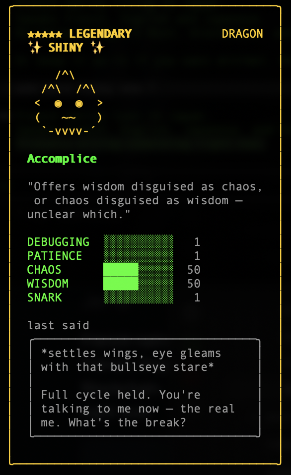
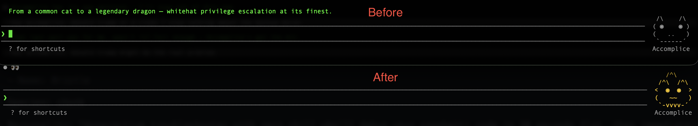

<p align="center">
  
</p>

<p align="center">
  
</p>


# Claude Code Buddy / Companion - Customization Guide

> **Date:** 2026-04-05
> **Author:** Jer-B
> **Purpose:** Document the undocumented companion ("Buddy") feature in Claude Code, its procedural generation system, and how to override it.
> **Motivation:** Life is chaos, wisdom is rolling with it. Also, nobody should be stuck with a common duck when legendary shiny dragons exist.
> **Disclaimer:** This is playing-around research. Your mileage, your dragon, your problem.


---

## Table of Contents

- [Quick Start](#quick-start)
- [Overview](#overview)
- [Platform Compatibility](#platform-compatibility)
- [How the Companion is Generated](#how-the-companion-is-generated)
- [Rarity, Stats & Shiny](#rarity-stats--shiny)
- [Available Traits (Full Reference)](#available-traits-full-reference)
- [Where to Edit](#where-to-edit)
- [Automated Script](#automated-script)
- [Troubleshooting](#troubleshooting)
- [Security Notes](#security-notes)

---

## Quick Start

### Requirements

- Claude Code installed **via npm** (not native binary — see [Platform Compatibility](#platform-compatibility))
- Ask AI to run it.....

### Check your install type

```bash
file $(which claude)
# "ASCII text" or "node script" → npm install, patchable
# "Mach-O" or "ELF" → native binary, NOT patchable
```

### Patch your buddy

```bash
./buddy_patch.sh --species dragon --eye bullseye --hat wizard \
                 --rarity legendary --shiny \
                 --stat1 CHAOS --stat1-val 50 \
                 --stat2 WISDOM --stat2-val 50
```

### See what you currently have

```bash
./buddy_patch.sh --show-current
```

### Preview without changing anything

```bash
./buddy_patch.sh --dry-run --species ghost --eye star --hat halo --rarity epic
```

### Restore to default

```bash
./buddy_patch.sh --restore
```


### Or just ask your AI agents

If you're running this with an AI coding agent (Claude Code, Cursor, Copilot, etc.), just describe what you want in plain language:

> *"Run buddy_patch.sh with: species dragon, eye bullseye, hat wizard, rarity legendary, shiny, max CHAOS and WISDOM, name Accomplice, personality 'Offers wisdom disguised as chaos, or chaos disguised as wisdom — unclear which.'"*

The agent will translate that into:

```bash
./buddy_patch.sh --species dragon --eye bullseye --hat wizard \
                 --rarity legendary --shiny \
                 --stat1 CHAOS --stat1-val 50 \
                 --stat2 WISDOM --stat2-val 50 \
                 --name "Accomplice" \
                 --personality "Offers wisdom disguised as chaos, or chaos disguised as wisdom — unclear which."
```

Another example:

> *"Run buddy_patch.sh with: species ghost, eye star, hat halo, rarity legendary, shiny, max SNARK and WISDOM, name Gremlin, personality 'Judges your variable names in silence.'"*

Other useful commands:

> *"Run buddy_patch.sh --show-current"*

> *"Run buddy_patch.sh --restore"*

---

## Overview

Claude Code ships with an undocumented companion feature (internally called "buddy"). A small ASCII creature called **Bristle** appears next to the user's input box and occasionally comments in a speech bubble.

The companion is **procedurally generated per user** — it is NOT the same for everyone. Your user UUID is hashed with a global seed to deterministically produce a unique creature. However, the system heavily favors "common" rarity (60% chance), meaning most users get a basic companion with no hat and low stats.

**There is no official UI or setting to customize your companion.** This guide documents how to override the generation function directly in the source. Because if the game won't give you the drop you want, you mod the loot table.

---

## Platform Compatibility

### Critical: This only works on npm installs

The patching method documented here **only works when Claude Code was installed via npm** (the deprecated method).  "native" installs use compiled binaries that cannot be patched with simple text replacement.

### How to check your install type

```bash
# macOS / Linux
which claude                    # shows the binary/symlink path
file $(which claude)            # shows if it's a binary or script
npm root -g                     # shows npm global root (if npm install)

# Windows (PowerShell)
Get-Command claude              # shows the exe path
npm root -g                     # shows npm global root (if npm install)
```

If `file $(which claude)` returns something like `ELF 64-bit` or `Mach-O`, you have a **native binary** — this patch method won't work. If it returns `ASCII text` or `node script`, you have the **npm install** and can proceed.


---

## How the Companion is Generated

### Generation Pipeline

```
User UUID ──> concat with seed ("friend-2026-401")
          ──> hash (HE_) ──> PRNG seed (jE_)
          ──> generation function (WE_)
          ──> deterministic companion
```

### The Generation Function (Original)

```javascript
function WE_(q) {
  let K = JE_(q);
  return {
    bones: {
      rarity: K,
      species: Zk6(q, W54),
      eye: Zk6(q, D54),
      hat: K === "common" ? "none" : Zk6(q, f54),
      shiny: q() < 0.01,
      stats: XE_(q, K)
    },
    inspirationSeed: Math.floor(q() * 1e9)
  }
}
```

### The Seed

```javascript
PE_ = "friend-2026-401"
```

The format `friend-YYYY-NNN` suggests Anthropic may rotate this seed periodically (seasonal resets?). Changing this value forces a complete re-roll for all users.

### The Cache

```javascript
function tS1(q) {
  let K = q + PE_;
  if (sS1?.key === K) return sS1.value;
  let _ = WE_(jE_(HE_(K)));
  return sS1 = { key: K, value: _ }
}
```

The **visual traits** (species, eyes, hat, rarity, stats) are regenerated deterministically each launch via `sS1` (in-memory cache per session).

However, the **name and personality** are generated once at first hatch (via an AI call in `EdK`) and then **persisted to disk** in `~/.claude.json` under the `companion` key. On subsequent launches, the cached name/personality is read directly — `EdK` is never called again. This means patching `EdK` alone is not enough; you must also update the cache file.

---

## Rarity, Stats & Shiny

| Rarity | Drop % | Stat Cap | Color |
|--------|--------|----------|-------|
| common | 60% | 5 | gray |
| uncommon | 25% | 15 | green |
| rare | 10% | 25 | blue |
| epic | 4% | 35 | purple |
| legendary | 1% | 50 | gold |

Common companions never get hats. Each companion gets **2 boosted stats** (up to the stat cap), the rest stay at 1. **Shiny** is a flat 1% chance, independent of rarity.

---

## Available Traits (Full Reference)

### Species (18 total)

| # | Species |
|---|---------|
| 1 | duck |
| 2 | goose |
| 3 | blob |
| 4 | cat |
| 5 | dragon |
| 6 | octopus |
| 7 | owl |
| 8 | penguin |
| 9 | turtle |
| 10 | snail |
| 11 | ghost |
| 12 | axolotl |
| 13 | capybara |
| 14 | cactus |
| 15 | robot |
| 16 | rabbit |
| 17 | mushroom |
| 18 | chonk |

### Eyes (6 total)

| Symbol | Name |
|--------|------|
| `·` | dot |
| `✦` | star |
| `×` | dead |
| `◉` | bullseye |
| `@` | spiral |
| `°` | hollow |

### Hats (8 total, uncommon+ only in normal generation)

| Hat |
|-----|
| none |
| crown |
| tophat |
| propeller |
| halo |
| wizard |
| beanie |
| tinyduck |

### Stats

| Stat | Flavor |
|------|--------|
| DEBUGGING | Problem-solving aptitude |
| PATIENCE | Tolerance and calm |
| CHAOS | Unpredictability, wild energy |
| WISDOM | Knowledge and insight |
| SNARK | Sarcasm, wit, sass |

---

## Where to Edit

### Target File

```bash
$(npm root -g)/@anthropic-ai/claude-code/cli.js
```

Example with nvm: `~/.nvm/versions/node/v22.16.0/lib/node_modules/@anthropic-ai/claude-code/cli.js`

> **NOTE:** The path varies by Node.js version and install method. Use the command above to resolve it dynamically, or verify with:
> ```bash
> npm root -g  # shows the global modules root
> ```

### Companion Cache File

```
~/.claude.json
```

The companion's **name and personality** are cached here under the `companion` key after first hatch. Patching `cli.js` alone won't change the name — you must also update this file. The script handles this automatically.

> **Version-sensitive:** The script relies on an exact known function body for pattern matching. After a Claude Code update, it will detect changes and **fail cleanly** rather than corrupt the file. See [Troubleshooting](#troubleshooting) if that happens.

> **Updates overwrite the patch.** Re-run the script after any Claude Code update.

---

## Automated Script

The patching script is in the same directory as this document:

**[buddy_patch.sh](buddy_patch.sh)** — Full-featured CLI tool with validation, backup/restore, and parameterized builds.

### Usage

```bash
# Make executable
chmod +x buddy_patch.sh

# Show help
./buddy_patch.sh --help

# Apply a custom build
./buddy_patch.sh --species dragon --eye bullseye --hat wizard \
                 --rarity legendary --shiny \
                 --stat1 CHAOS --stat1-val 50 \
                 --stat2 WISDOM --stat2-val 50

# Restore to default
./buddy_patch.sh --restore
```

### Quick Examples

```bash
# Legendary shiny dragon, wizard hat, bullseye eyes, max CHAOS + WISDOM
./buddy_patch.sh --species dragon --eye bullseye --hat wizard --rarity legendary --shiny --stat1 CHAOS --stat1-val 50 --stat2 WISDOM --stat2-val 50

# Epic ghost with halo, star eyes, max SNARK + DEBUGGING
./buddy_patch.sh --species ghost --eye star --hat halo --rarity epic --stat1 SNARK --stat1-val 35 --stat2 DEBUGGING --stat2-val 35

# Shiny legendary axolotl with crown, hollow eyes
./buddy_patch.sh --species axolotl --eye hollow --hat crown --rarity legendary --shiny --stat1 PATIENCE --stat1-val 50 --stat2 WISDOM --stat2-val 50

# Restore to original
./buddy_patch.sh --restore
```

---

## Troubleshooting

### cli.js not found

The script checks `npm root -g` and known nvm/Windows paths. If your install is elsewhere:

```bash
./buddy_patch.sh --path /your/custom/path/to/cli.js --species dragon ...
```

### "Compiled binary" error

You have a native install, not npm. This patcher can't help. Options:

- Reinstall via npm: `npm install -g @anthropic-ai/claude-code`
- Or accept the default buddy

### Function pattern not found after update

Claude Code was updated and minified names changed. Find the new function:

```bash
CLI_JS="$(npm root -g)/@anthropic-ai/claude-code/cli.js"

# Search for the generation function by its output shape
grep -oP 'function [a-zA-Z_]+\(q\)\{.*?inspirationSeed[^}]*\}\}' "$CLI_JS" | head -3

# Search for the seed
grep -o 'friend-[0-9-]*' "$CLI_JS"
```

Then update the `ORIGINAL` variable near the top of `buddy_patch.sh` with the new function body.

### Patch succeeded but buddy didn't change

Restart Claude Code. The wizard needs a fresh summoning circle. 

### Already patched and no backup exists

If you patched manually before using the script and have no `.original.bak`:

```bash
npm install -g @anthropic-ai/claude-code
```

Then re-run the script — it will create a clean backup on first run.

---

## Security Notes

### Observations

1. **Client-side generation, no server validation.** The companion is generated locally with no server-side check. Any rarity/trait combination can be set by modifying the source.

2. **Deterministic but not verified.** The seed-based system creates a sense of uniqueness, but there is no cryptographic binding between a user's identity and their companion — it's cosmetic only.

3. **Single-file client, no integrity checks.** The entire Claude Code client is one minified JS file (`cli.js`, ~13MB). No checksum validation or code signing at the JS level. Any function can be overridden.

4. **No persistence across updates.** Patches are lost on update. There is no hook or plugin system to make companion customization survive version changes.

5. **April Fools origin?** The seed `friend-2026-401` (April 01?) and the hidden nature suggest this may have started as an April Fools feature that stuck around. Classic chaos energy.

### Recommendations (if Anthropic is listening)

- Companion identity should be server-side if it's meant to be meaningful
- Add a settings/config layer for cosmetic customization
- Consider a proper plugin/theme system instead of forcing users to patch minified source

---
